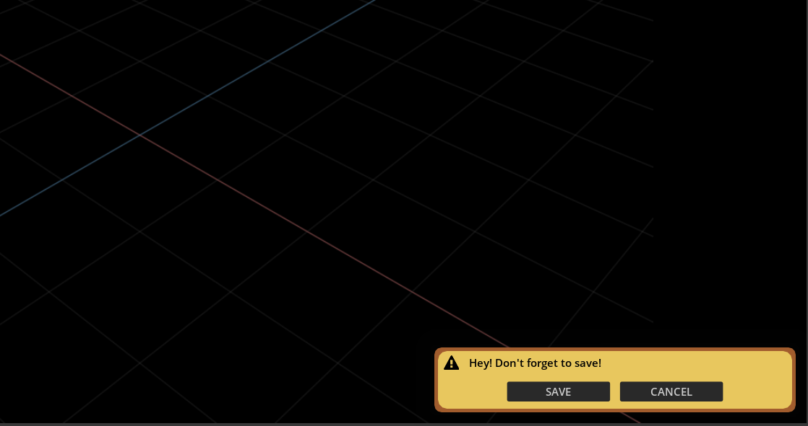
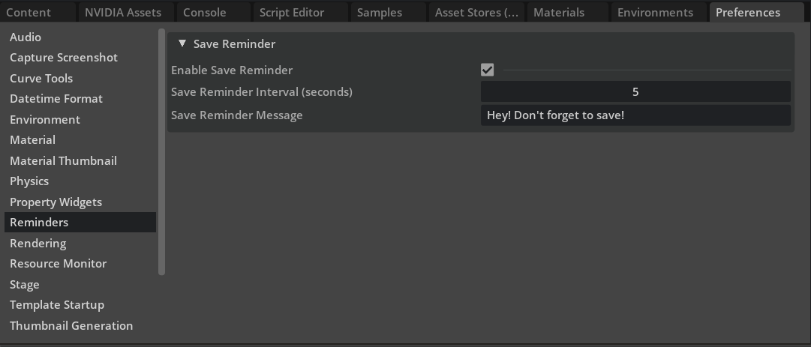

# Save Reminder [maticodes.notify.reminder]

A simple extension that reminds you to save your work on a timer.

## Preferences
There are a few preferences that you can set to customize the functionality. You can access the preferences by clicking on Edit->Preferences.

