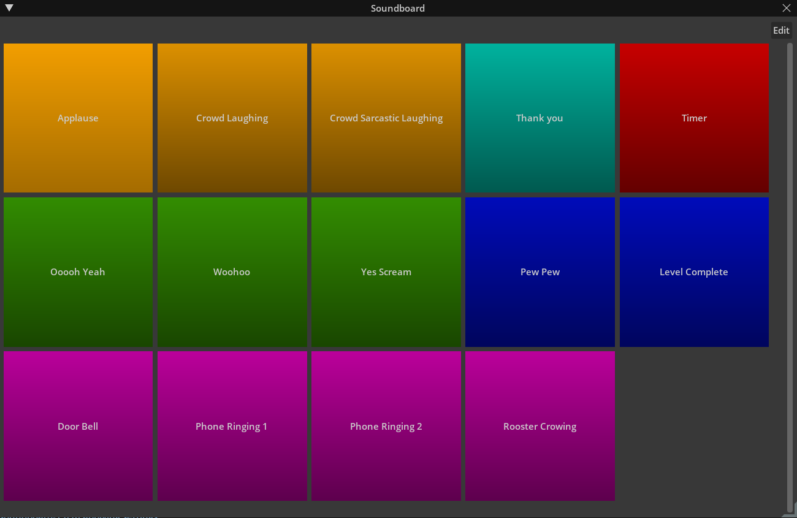

# Soundboard Window

This is a simple sound effects soundboard extension. Have some fun with it and use it for learning
Kit. Sound of the concepts that you can learn from the Code With Me recordings and this repository:
- Drag and Drop
- External Drag and Drop
- Modal Window
- Using persistent and transient carb.settings
- Using carb.tokens
- Custom events

## Performance Mode

This mode is just a window with a grid of buttons to have a simple UX for playing sounds. Click on a button to play its sound. You can click on the "Edit" button to switch to "Edit" mode.

## Edit Mode 

In this mode, you can:
- Resize the buttons
- Drag and drop from the move handle to reorder the buttons.
- Assign custom colors to the buttons
- Rename buttons
- Remove buttons
- Preview sounds from the Sounds Palette at the bottom of the window
- Add buttons from the Sounds Palette
- Add a new sound to the active sounds and Sounds Palette by dragging a sound file into the window.

## Included Sound Files 
The included sound files in this extension are CC0 from [freesound.org](https://freesound.org).